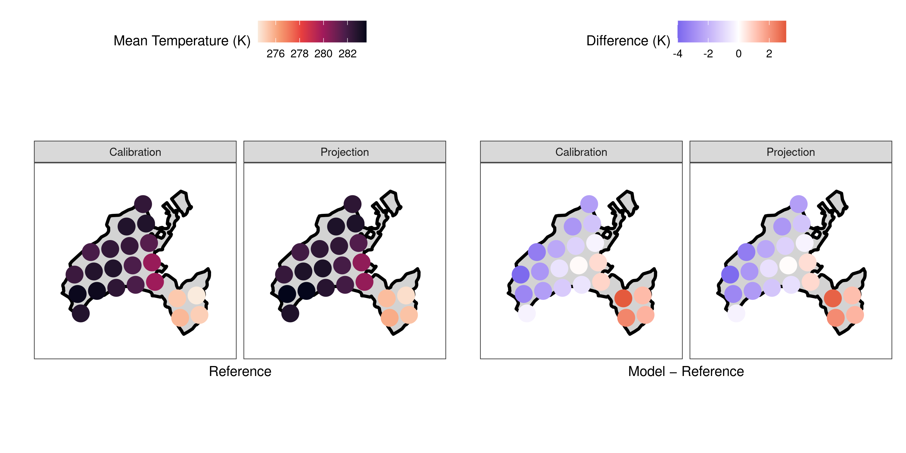
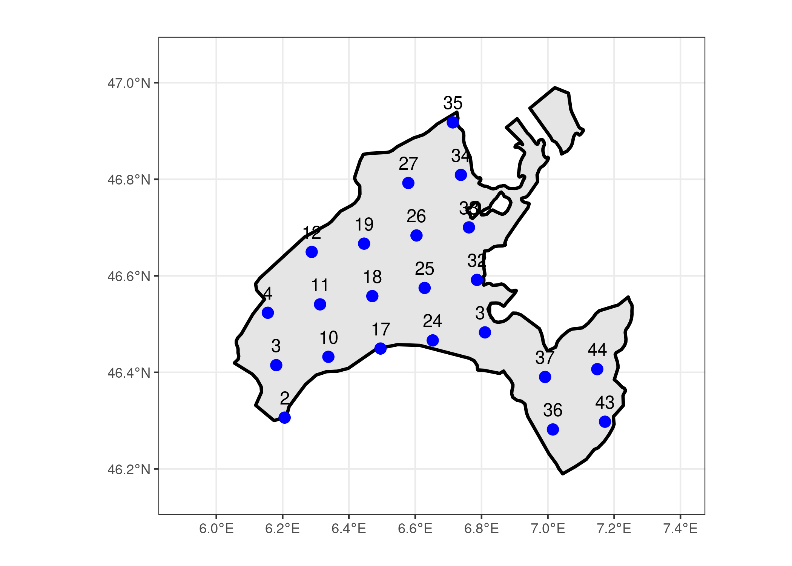
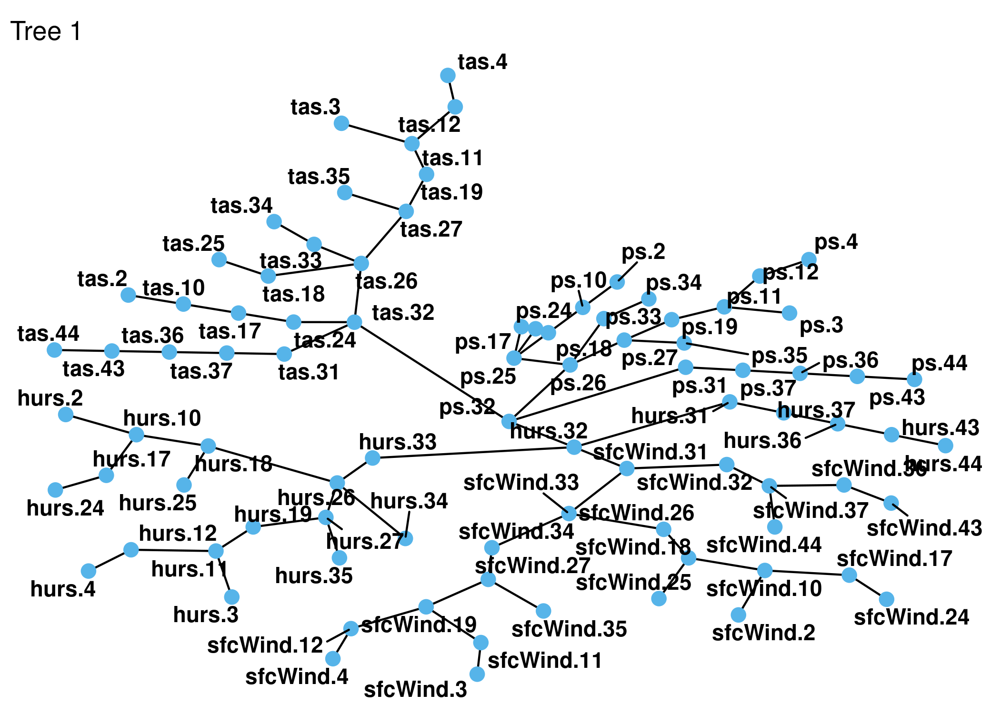
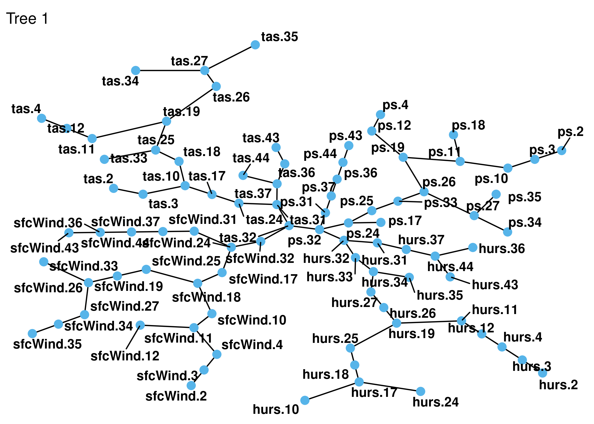
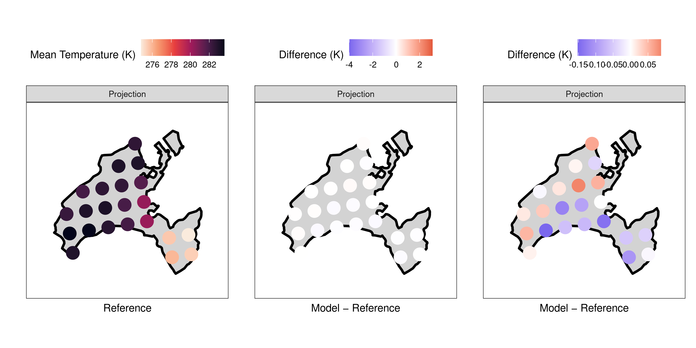

<!-- README.md is generated from README.Rmd. Please edit that file -->

# Multivariate Bias Correction using GAMs and Nested Vine Copulas (NVC)

<!-- badges: start -->

<!-- badges: end -->

GN-VBC is a multivariate bias correction method for climate projections
explicitly designed to preserve inter-variable, spatial and temporal
dependence structures. The method is based on VBC by Funk et al. (2025)
integrating Probability Integral Transforms (PIT) derived from
Generalized additive models (GAMs), and nested vine copulas (NVC), a
novel vine merging technique integrating two layers of dependence:
spatial and inter-variable. It is designed for potentially zero-inflated
climate variables, such as precipitation, and can be applied to multiple
variables and locations simultaneously.

## Installation

You can install the development version of cuveeMBC from
[GitHub](https://github.com/) with:

``` r
remotes::install_github("TheresaMeier/cuveeMBC")
```

## Example

Within the package, we provide an example dataset consisting of gridded
reference and model data for 22 stations in the canton of Vaud,
Switzerland, and four variables: temperature, relative humidity, wind
speed and surface pressure. We use
[Cordex](https://cds.climate.copernicus.eu/datasets/projections-cordex-domains-single-levels?tab=overview)
as model data on a 0.11° resolution. As reference we use
[ERA5-land](https://cds.climate.copernicus.eu/datasets/reanalysis-era5-land?tab=overview)
data remapped to Cordex resolution using conservative remapping. Both
Cordex and ERA5-land are publicy available. The data is available in the
package as `bc_data` and includes daily reference and model data for a
calibration period of 1990-2009 (`rc`and `mc`), as well as for a
projection period of 2010-2019 (`rp`and `mp`). In addition, coordinates
of the 22 grid points are provided. We will bias correct the data using
the `gn_vbc` function.

The example code demonstrates how to apply the `GN-VBC` method to this
dataset, including fitting GAMs, extracting components, fitting nested
vine copulas, and performing bias correction.

``` r
library(data.table)
library(ggplot2)
library(knitr)
library(VBC)
library(dplyr)
library(tidyr)
library(patchwork)
library(cuveeMBC)

data("bc_data")

names_bc = names(bc_data)

# Cut the time frames for faster computation
bc_data[1:4] = lapply(names(bc_data)[-5], function(x) bc_data[[x]] %>%
                  filter(between(time, as.Date("2000-01-01"), as.Date("2015-12-31")))
)
names(bc_data) = names_bc
```

To give an idea about the distribution of the data, we show differences
in mean temperature between reference and model projections. Note that
since the time periods are chosen differently in the main paper and
another reference is used (here ERA5-land, data provided by MeteoSwiss
in the paper), the figure shows slightly different values.


We observe that the model underestimates mean temperatures in the
Eastern part of the canton, while it overestimates them in the Western
part, clearly giving an incentive for bias correction. The differences
are similar for both the calibration and projection period.

In order to assess distributional similarity, we compute Wasserstein
distances between the model and reference data for each variable. This
serves as an indicator for preservation of spatial dependence.

``` r
wd_pre <- list()

vars <- c("tas", "hurs", "sfcWind", "ps")

# Loop over variables and calculate spatial Wasserstein distances
for (var in vars) {
  wd <- VBC::calc_wasserstein(
    bc_data$rp %>% select(starts_with(paste0(var, "."))),
    bc_data$mp %>% select(starts_with(paste0(var, ".")))
  )
  
  wd_pre[[var]] <- wd
}

wd_df <- do.call(cbind, wd_pre) %>% as.data.frame()
colnames(wd_df) <- vars
rownames(wd_df) <- c("WD 1", "WD 2")  


knitr::kable(wd_df, digits = 3, caption = "Wasserstein distances prior to bias correction")
```

|      |   tas |  hurs | sfcWind |     ps |
|:-----|------:|------:|--------:|-------:|
| WD 1 | 1.480 | 1.686 |   8.415 | 19.184 |
| WD 2 | 1.517 | 1.854 |   9.486 | 19.192 |

Wasserstein distances prior to bias correction

In the next step, we apply the `gn_vbc` function to bias correct the
model data. Note that this is a computationally intensive step,
especially for larger datasets, and may take some time to run.

We calculate Wasserstein distances again to assess the improvement in
distributional similarity after bias correction.

``` r
wd_post <- list()
# Loop over variables and calculate spatial Wasserstein distances
for (var in vars) {
  wd <- VBC::calc_wasserstein(
    bc_data$rp %>% select(starts_with(paste0(var, "."))),
    mp_corrected$corrected_mp %>% select(starts_with(paste0(var, ".")))
  )
  
  wd_post[[var]] <- wd
}

wd_df <- do.call(cbind, wd_post) %>% as.data.frame()
colnames(wd_df) <- vars
rownames(wd_df) <- c("WD 1", "WD 2")  
```

|               |  tas | hurs | sfcWind |   ps |
|:--------------|-----:|-----:|--------:|-----:|
| Wasserstein_1 | 49.6 | 45.7 |    86.1 | 98.3 |
| Wasserstein_2 | 40.9 | 45.2 |    84.2 | 97.7 |

Improvement in Wasserstein distances (%)

We can visualize the resulting first tree of the estimated copulas for
both `mp` and `rc`.

``` r
library(rvinecopulib)

# Switzerland cantons
swiss_cantons <- rnaturalearth::ne_states(country = "Switzerland", returnclass = "sf")
vaud <- swiss_cantons[swiss_cantons$name == "Vaud", ]

points_sf <- sf::st_as_sf(
  bc_data$locations,
  coords = c("Lon", "Lat"),
  crs = 4326
)

ggplot() +
  geom_sf(data = vaud, fill = "grey90", color = "black", linewidth = 1) +
  geom_sf(data = points_sf, color = "blue", size = 3) +
  geom_text(
    data = bc_data$locations,
    aes(x = Lon, y = Lat, label = Id),
    vjust = -1,
    size = 4
  ) +
  coord_sf(
    xlim = c(5.9, 7.4),
    ylim = c(46.15, 47.05)
  ) +
  theme_bw() +
  labs(title = "",
       x = "",
       y = "")
```



``` r

par(mfrow = c(1, 2))
plot(mp_corrected$rvine_mp, var_names = "use", main = "mp")
```



``` r
plot(mp_corrected$rvine_rc, var_names = "use", main = "rc")
```



Finally, we can visualize the bias-corrected mean temperature values per
grid cell and compare them to the reference data.


We see that the bias correction has successfully reduced the differences
in mean temperature between model and reference. In the middle panel, we
apply the same range of differences as in the plot above, while in the
right panel we zoom in to detect small deviations from the reference.
The improvement in Wasserstein distances indicates that the bias
correction has also improved the distributional similarity between model
and reference data, suggesting that spatial dependence structures have
been better preserved.

## Citation

If you use `GN-VBC` in a scientific publication, please cite the
following paper:

\[add archive link\]

## References

Funk, H., Ludwig, R., Küchenhoff, H., Nagler, T. (2025). Towards more
realistic climate model outputs: a multivariate bias correction based on
zero-inflated vine copulas. Journal of the Royal Statistical Society
Series C: Applied Statistics; qlaf044.

Copernicus Climate Change Service (C3S)(2019): ERA5-Land hourly data
from 1950 to present. Copernicus Climate Change Service (C3S) Climate
Data Store (CDS). DOI: 10.24381/cds.e2161bac (Accessed on 19-03-2025).

Copernicus Climate Change Service, Climate Data Store, (2019): CORDEX
regional climate model data on single levels. Copernicus Climate Change
Service (C3S) Climate Data Store (CDS). DOI: 10.24381/cds.bc91edc3
(Accessed on 13-02-2025).
